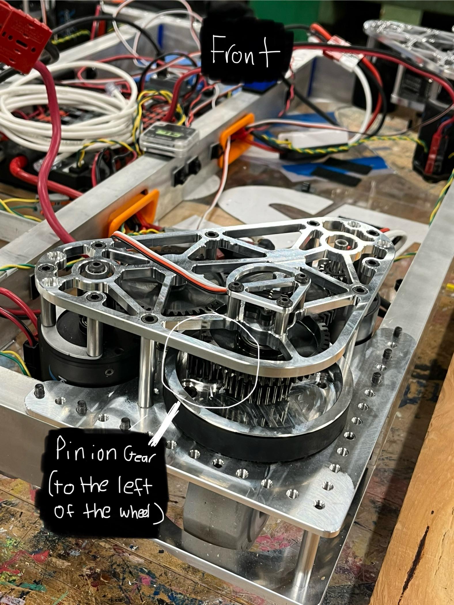
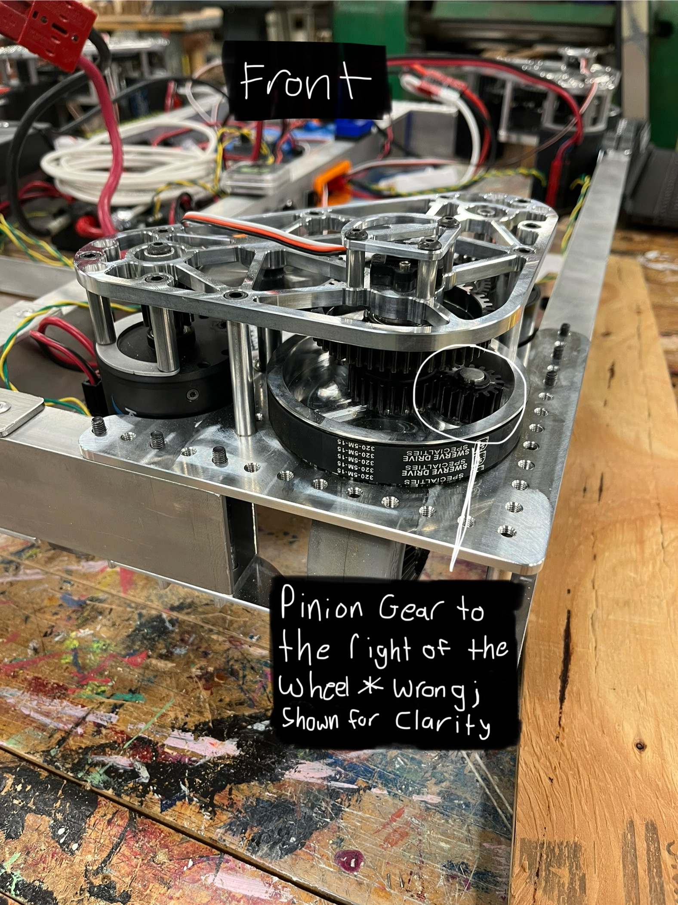
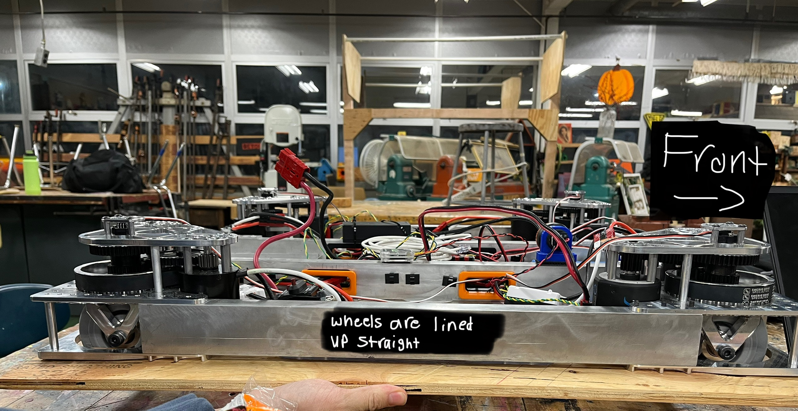

# Steering-Motor-Calibration
To calibrate a motor, there are a few steps that need to be completed.

1. Find a plank of wood that spans the distance of two wheels so that we can line the wheels up straight and facing forward.

2. Start the robot, connect to it and Open WPiLib and then glass (elipses then start tool); you want to locate the values that say CalibrationFrontLeft, FrontRight, etc. These will be under the DriveTrain dropdown and inside of that the SwerveModule dropdown.

3. Once located make sure that your pinion gear (shown in the picture) is to the left of the wheel when facing forward (blue tape is forward).

4. Take the wooden plank and line 2 wheels up (on one side) with both pinion gears to the left of their respective wheels.

5. Once two wheels are lined up on one side, go back into glass and check the values that are being outputed for the side that you lined up. In Constants.java, locate "public static double kCalibrationFrontLeft, FrontRight, etc" under kSwerveModule and change the values to their respective values being shown in glass. 

*Caution:* Make sure that you only do one side (left or right) at a time and use the values after you have completely lined up the wheels; you don't want to line up the rear or front wheels.

6. Once you finish changing the values of the side you lined up, repeat steps 3-5 for the other two wheels.

Once all 6 steps are done, your wheels should be calibrated.